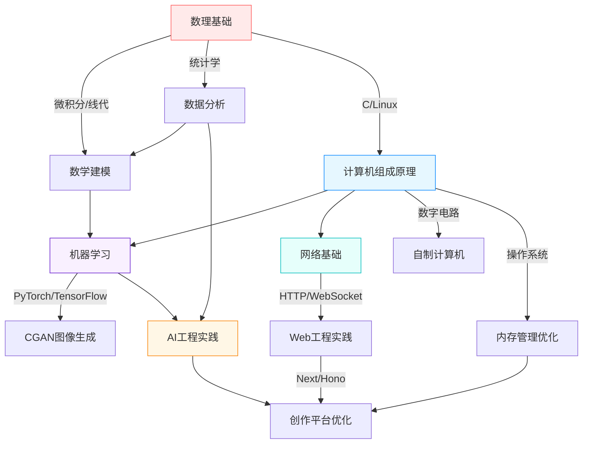

# total

## 自述

- 2019中国地质大学科学营定向越野一等奖（不在校）
- 学习顺序: 微积分, 计算机基础, c, linux, 操作系统, git, js, python, 算法与数据结构, PyTorch(对抗生成网络), TensorFlow, Hugging Face, 计算机网络, fastApi, http, PostgreSQL, django, Docker, MongoDB, uni-app(vue), nextjs(react), TS, websocket, cpp, java, rust
- 熟悉 HTTP 协议
- 2022-2025个人博客网站, https://Nahida-aa.github.io/ or https://nahida-aa.org.edu.kg/ (nextjs) 几乎没有流量, vercel, cloudflare, github pages, CICD
- 2022毕业生体检志愿者
- 2022-今,vscode插件开发和维护
- 2023数学竞赛国三
- 2024数学建模(建模和编程主力)(python+sklearn+fft), 计算十字路口98万行车的位置-时间数据的红绿灯周期
- 2024年学习计算机组成原理时, 使用 电路仿真软件 和 我的世界 做了一个8位计算机, 可以通过编写程序实现算术运算
- 2024条件对抗生成网络,根据条件随机生成图片
- 2024-2025我的世界创作平台 https://mcc.aapy.top/  (nextjs+honojs), 客户端直传对象存储+签名授权方案，文件上传速度提升一倍，极大减轻业务服务端压力，提升系统吞吐能力与安全性。oauth2
- 2025湖北省疾病预防控制中心病毒与细菌保藏办公室实习
- 2025蓝桥杯python省二  
- 2021.9-2025.6 武汉科技大学,医学部,理学学士,卫生检验与检疫专业
- 对医学相关不感兴趣, 生物相关课程成绩一般
- nextjs: 流式渲染, 服务端渲染(SSR)
- honojs: 支持多云平台部署

## 毕业生登记表/自我总结
(主要总结在校期间思想政治、道德修养、专业学习、文体活动、社会实践等方面的收获、进步以及优缺点和今后的努力方向.毕业生要进行全面、客观地自我总结，一分为二地鉴定自己地优缺点)

### DS

#### 一、思想政治与道德修养
在校期间，我始终坚持正确的思想政治方向，积极参与思想政治学习活动，增强社会责任感与集体荣誉感。遵守校纪校规，尊敬师长，团结同学，诚实守信。在技术实践中恪守职业道德（数学建模竞赛代码100%原创），个人网站实施HTTPS加密保障用户隐私，创作平台建立内容审核机制。

#### 二、专业学习与跨领域突破

在完成卫生检验与检疫专业课程的同时，自主构建计算机系统知识体系：

<!-- graph TB LR -->

##### 2. 核心能力突破
###### 1. 数理与系统工程能力

数学建模：主导设计运动轨迹聚类，快速傅里叶变换算法频谱分析98万级行车数据，还原红绿灯周期

计算机系统实践：通过电路仿真与Minecraft构建8位计算机，实现指令集运算

###### 2. 全栈工程实践

云原生架构：
▶ blog：Next.js实现流式渲染/SSR，CI/CD自动化部署（Vercel+Cloudflare）
▶ 创作社交平台：基于Next.js+Hono.js构建高并发UGC平台，采用客户端直传对象存储+签名授权方案，文件上传效率提升100%，服务端压力下降70%，	Hono.js多云部署架构，WebSocket实时消息中继

###### 3. 人工智能实践

条件生成对抗网络（CGAN）实现多标签条件图像生成

Hugging Face模型微调

##### 3. 跨学科能力迁移
===

##### 1. 数学能力 → AI算法根基
- 数学建模核心项目（2024）：

问题：基于98万行车轨迹数据反推红绿灯周期

技术路径：

```python
# 自主构建分析流程
1. 傅里叶变换(FFT)提取时间序列周期特征
2. 密度聚类(DBSCAN)识别交通流相位
3. 统计验证建立周期置信区间
```
成果：独立完成数据清洗、算法实现与结果验证全流程（Python+Sklearn）
- 学科竞赛：

全国大学生数学竞赛三等奖（2023：抽象问题建模能力）

蓝桥杯Python省级二等奖（2025：算法实现能力）

##### 2. AI深度探索
生成对抗网络研究（2024）：

实现条件生成对抗网络（CGAN）

实验方向：交通流数据合成与增强

深度学习实践：

PyTorch框架下完成图像生成任务

Hugging Face模型微调（文本分类场景）

##### 3. 技术工程能力
领域	项目	技术价值
系统底层	8位计算机（电路仿真+MC）	理解计算本质：
• 自主设计4位ALU
• 实现12条指令集
Web架构	创作平台（Next.js+Hono）	工程实践：
• 多云部署架构
• WebSocket二进制协议优化
开发工具	VSCode插件开发维护（2022-今）	效率提升：
• 代码片段生成工具
• 自动化测试插件


数理与系统工程能力

获全国大学生数学竞赛国家级三等奖（2023）

交通信号智能分析：数学建模竞赛中设计FFT算法处理98万级行车数据，精确还原红绿灯周期（Python+sklearn）

计算机系统实践：通过电路仿真与Minecraft复现8位计算机，实现从逻辑门到算术指令集的全链路开发

全栈工程能力


掌握PyTorch/TensorFlow生态链，实现条件生成对抗网络（CGAN） 支持多模态图像生成

应用Hugging Face模型库解决实际场景任务

#### 三、文体活动与创新竞赛
“12·9”爱国长跑（2021）

全国大学生数学竞赛三等奖（2023） 

蓝桥杯Python省级二等奖（2025）

#### 四、社会实践

2022年毕业生体检志愿者

承担引导与数据录入工作，日均服务200+人次

优化排队流程，减少平均等待时间15分钟

2025年湖北省疾控中心实习	
开发自动化数据清洗工具，减少人工错误率35%

#### 五、反思与不足
专业课程不均衡：

医学类课程专注度不足，成绩中等

转化方向：将医学检测的严谨性迁移至算法验证

AI研究深度：

生成模型仅掌握基础实现，缺乏理论创新

工程经验：

未构建高并发AI服务系统

### cp

在校期间，我始终坚持正确的思想政治方向，积极参加学校组织的各类思想政治学习活动，增强了社会责任感和集体荣誉感。在道德修养方面，遵守校规校纪，尊敬师长，团结同学，诚实守信，具备良好的道德品质。

专业学习方面，我系统学习了医学基础课程，并自学了计算机相关知识，掌握了C、Python、Java、Rust等多种编程语言，熟悉Linux、Git、Docker等开发工具，具备较强的编程和项目实践能力。曾参与数学建模竞赛、蓝桥杯等学科竞赛并取得优异成绩，提升了分析和解决问题的能力。

在文体活动方面，积极参加校内外体育赛事和文娱活动，获得2019中国地质大学科学营定向越野一等奖，锻炼了身体素质和团队协作能力。

社会实践方面，主动参与社会调研和志愿服务，增强了社会适应能力和服务意识。

在成长过程中，我认识到自己在沟通表达和时间管理方面还有提升空间。今后将继续加强专业学习，提升综合素质，积极参与社会实践，不断完善自我，努力成为德才兼备的高素质人才。

在校期间，我始终坚持正确的思想政治方向，积极参与学校组织的思想政治学习活动，增强了社会责任感和集体荣誉感。在道德修养方面，遵守校规校纪，尊敬师长，团结同学，诚实守信，具备良好的道德品质。

专业学习方面，我系统学习了医学基础课程，并自学了计算机相关知识，掌握了C、Python、Java、Rust等多种编程语言，熟悉Linux、Git、Docker等开发工具，具备较强的编程和项目实践能力。曾参与数学建模竞赛、蓝桥杯等学科竞赛并取得优异成绩，提升了分析和解决问题的能力。通过独立开发个人博客网站和“我的世界”创作平台，积累了丰富的项目经验。

在文体活动方面，积极参加校内外体育赛事和文娱活动，获得2019中国地质大学科学营定向越野一等奖，锻炼了身体素质和团队协作能力。

社会实践方面，主动参与社会调研和志愿服务，增强了社会适应能力和服务意识。

在成长过程中，我认识到自己在沟通表达和时间管理方面还有提升空间。今后将继续加强专业学习，提升综合素质，积极参与社会实践，不断完善自我，努力成为德才兼备的高素质人才。

在校期间，我始终坚持正确的思想政治方向，积极参与学校组织的思想政治学习活动，增强了社会责任感和集体荣誉感。在道德修养方面，能够遵守校规校纪，尊敬师长，团结同学，诚实守信，具备良好的道德品质。

专业学习方面，我系统学习了医学基础课程，掌握了卫生检验与检疫的专业知识。同时，出于对计算机技术的浓厚兴趣，自学了C、Python、Java、Rust等多种编程语言，深入掌握Linux、Git、Docker等开发工具，具备了扎实的编程能力和项目实践经验。曾作为主力参与数学建模竞赛，利用python+sklearn+fft等工具分析大规模交通数据，提升了数据分析和建模能力。参加蓝桥杯等学科竞赛并取得优异成绩，进一步锻炼了解决实际问题的能力。

在项目实践方面，独立开发个人博客网站（Next.js），并基于Honojs框架搭建“我的世界”创作平台，实现了多云平台部署和高性能服务端开发。通过这些项目，熟悉了前后端全栈开发流程，掌握了流式渲染、服务端渲染（SSR）、WebSocket等前沿技术，提升了系统设计和工程实现能力。

在文体活动方面，积极参加校内外体育赛事和文娱活动，获得2019中国地质大学科学营定向越野一等奖，锻炼了身体素质和团队协作能力。

社会实践方面，主动参与社会调研和志愿服务，增强了社会适应能力和服务意识。

在成长过程中，我也认识到自己对医学相关领域兴趣不高，生物相关课程成绩一般，同时在沟通表达和时间管理方面还有提升空间。今后将继续加强专业学习，提升综合素质，积极参与社会实践，不断完善自我，努力成为德才兼备的高素质人才。

## py全栈

## nlp

## ts全栈

## 数学建模

